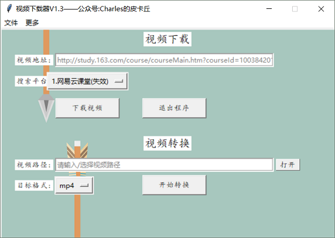
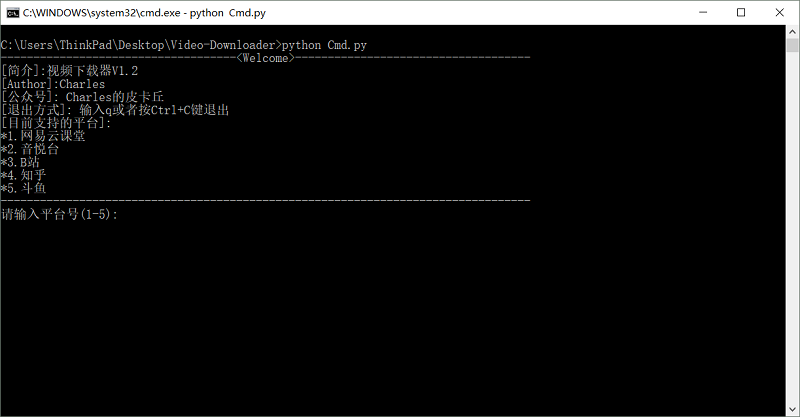

# Video-Downloader
```sh
Video Downloader  
You can star this repository to keep track of the project if it's helpful for you, thank you for your support.
```

# To do
- [x] Video download.
- [x] Video convert(Just use ffmpeg, to realize a simple additional function).

# Support
#### in Downloader
- [x] [Ted](https://www.ted.com/talks?language=zh-cn) → [Url Example](https://www.ted.com/talks/tina_seelig_the_little_risks_you_can_take_to_increase_your_luck?language=zh-cn)
- [x] [CNTV](http://tv.cntv.cn/) → [Url Example](http://tv.cntv.cn/video/C10881/4ec8c6c1bdd941b0b11280769b036e8b)
- [x] [Zhihu](https://www.zhihu.com/) → [Url Example](https://www.zhihu.com/question/21395276/answer/425130152)
- [x] [Douyu](https://www.douyu.com/) → [Url Example](https://v.douyu.com/show/8KxjMdB3GQQvVLwb)
- [x] [Zhanqi](https://videos.zhanqi.tv/) → [Url Example](https://www.zhanqi.tv/v2/videos/767817.html)
- [x] [Tecent](https://v.qq.com/) -> [Url Example](https://v.qq.com/x/cover/7r83y1oca851nq6/n0711wto8h4.html)
- [x] [Bilibili](https://www.bilibili.com/) → [Url Example](https://www.bilibili.com/video/av26443123?spm_id_from=333.338.__bofqi.13)
- [x] [Wangyiyun](https://study.163.com/) → [Url Example](http://study.163.com/course/courseMain.htm?courseId=1003842018)
- [x] [Yinyuetai](http://www.yinyuetai.com) → [Url Example](http://v.yinyuetai.com/video/3247548)
#### not in Downloader
- [x] [Douyin](https://github.com/CharlesPikachu/Video-Downloader/tree/master/not_in_downloader/douyin)
- [x] [liveCache](https://github.com/CharlesPikachu/Video-Downloader/tree/master/not_in_downloader/liveCache)

# Usage
#### Step1
```sh
Download this repository:  
Clone or download.
```
#### Step2
```sh
Install some dependencies:
"pip install -r requirements.txt" or  
"py -3 -m pip install -r requirements.txt"  
```
#### Step3
```sh
Run Demo.py or Cmd.py:
"python Demo.py" or "py -3 Demo.py" or  
"python Cmd.py" or "py -3 Cmd.py"
```

# Platform[Tested]
- Win10  
- Python3.6  

# Record
#### 2018-07-11
- Version: V1.0
- Detail: Three platforms supported.
#### 2018-07-22
- Version: V1.0
- Detail: add "not_in_downloader" folder to support downloading douyin videos by douyin user id.
#### 2018-08-05
- Version: V1.1
- Detail: Support downloading zhihu video.
#### 2018-08-21
- Version: V1.2.0
- Detail: Support downloading douyu, ted, cntv video.
#### 2018-08-26
- Version: V1.2.1
- Detail: Support downloading zhanqi video.
#### 2018-09-03
- Version: V1.2.1
- Detail: Start to support live cache.
#### 2018-09-21
- Version: V1.3  
- Detail: Support downloading tecent video.

# Running Screenshot
#### Demo.py

#### Cmd.py


# More
#### WeChat Official Accounts
*Charles_pikachu*  
