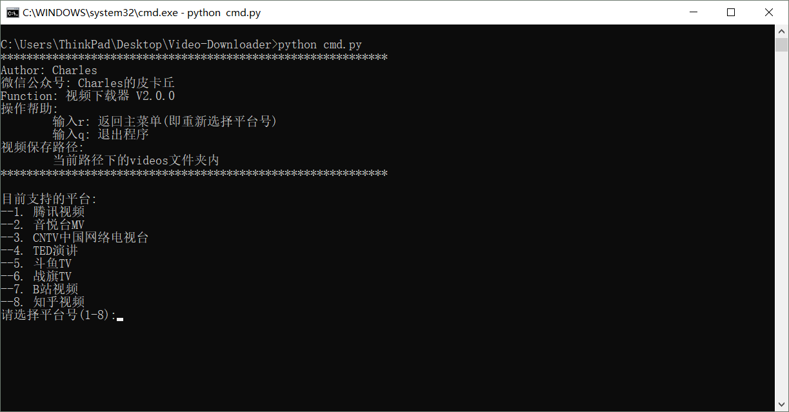

# Video-Downloader
```sh
Video Downloader  
You can star this repository to keep track of the project if it's helpful for you, thank you for your support.
```

# Introduction in Chinese
prepare

# Support
- [x] [tecent](https://v.qq.com/)
- [x] [yinyuetai](http://www.yinyuetai.com)
- [x] [cntv](http://tv.cntv.cn/)
- [x] [ted](https://www.ted.com/talks?language=zh-cn)
- [x] [douyu](https://www.douyu.com/)

# Usage
#### Step1
```sh
Download this repository:
Clone or download.
```
#### Step2
```sh
Install some dependencies:  
"pip install -r requirements.txt" or  
"py -3 -m pip install -r requirements.txt"  
```
#### Step3
```sh
run cmd.py, for example:  
"python cmd.py" or "python3 cmd.py"
```
#### Supplement: some example urls
```sh
tecent: https://v.qq.com/x/cover/7r83y1oca851nq6/g07185bhudr.html
yinyuetai: http://v.yinyuetai.com/video/324
cntv: http://tv.cntv.cn/video/C10881/4ec8c6c1bdd941b0b11280769b036e8b
ted: https://www.ted.com/talks/glenn_cantave_how_augmented_reality_is_changing_activism?language=zh-tw
douyu: https://v.douyu.com/show/8KxjMdB3GQQvVLwb
```

# Environment
- Windows/Linux
- Python3.5+(have installed necessary dependencies.)

# Running Screenshot
#### cmd.py


# Log
see Log dir → [click](./LOG)

# More
#### WeChat Official Accounts
*Charles_pikachu*  
