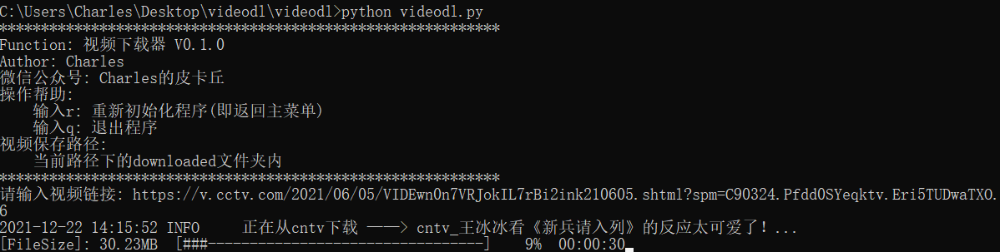

<div align="center">
  
</div>
<br />

[](https://github.com/CharlesPikachu/videodl/blob/master/LICENSE)
[](https://github.com/CharlesPikachu/videodl/issues)
[](https://github.com/CharlesPikachu/videodl/issues)

Documents: still on the way


# Videodl
```
A lightweight video downloader written by pure python.
You can star this repository to keep track of the project if it's helpful for you, thank you for your support.
```


# Statement
```
This repository is created just for learning python(Commercial prohibition).
All the apis used in this repository are from public network. So, if you want to download the paid videos, 
please open a paid member on corresponding video platform by yourself (respect the video copyright please).
Finally, if there are any infringements, please contact me to delete this repository.
```


# Support List
| Websites                                | Introduction                                               | Code                                         |  in Chinese   |
| :----:                                  | :----:                                                     | :----:                                       |  :----:       |
| [cntv](https://v.cctv.com/)             | [click](https://mp.weixin.qq.com/s/xjl7SLEOlEbYu3d8RHZaGQ) | [click](./videodl/modules/sources/cntv.py)   |  央视网       |
| [mgtv](https://www.mgtv.com/)           | [click]()                                                  | [click](./videodl/modules/sources/mgtv.py)   |  芒果TV       |
| [migu](https://www.migu.cn/video.html)  | [click]()                                                  | [click](./videodl/modules/sources/migu.py)   |  咪咕视频     |
| [acfun](https://www.acfun.cn/)          | [click]()                                                  | [click](./videodl/modules/sources/acfun.py)  |  AcFun视频    |
| [douyin](https://www.douyin.com/)       | [click](https://mp.weixin.qq.com/s/7N4pt1kLnVEJlve75zpdwA) | [click](./videodl/modules/sources/douyin.py) |  抖音         |
| [haokan](https://haokan.baidu.com/)     | [click]()                                                  | [click](./videodl/modules/sources/haokan.py) |  好看视频     |


# Install
#### Pip install
```sh
run "pip install videodl"
```
#### Source code install
```sh
(1) Offline
Step1: git clone https://github.com/CharlesPikachu/videodl.git
Step2: cd videodl -> run "python setup.py install"
(2) Online
run "pip install git+https://github.com/CharlesPikachu/videodl.git@master"
```


# Quick Start
```python
from videodl import videodl

config = {
    "logfilepath": "videodl.log",
    "proxies": {},
    "savedir": "downloaded"
}
dl_client = videodl.videodl(config=config)
dl_client.run()
```


# Screenshot



# More
#### WeChat Official Accounts
*Charles_pikachu*  
